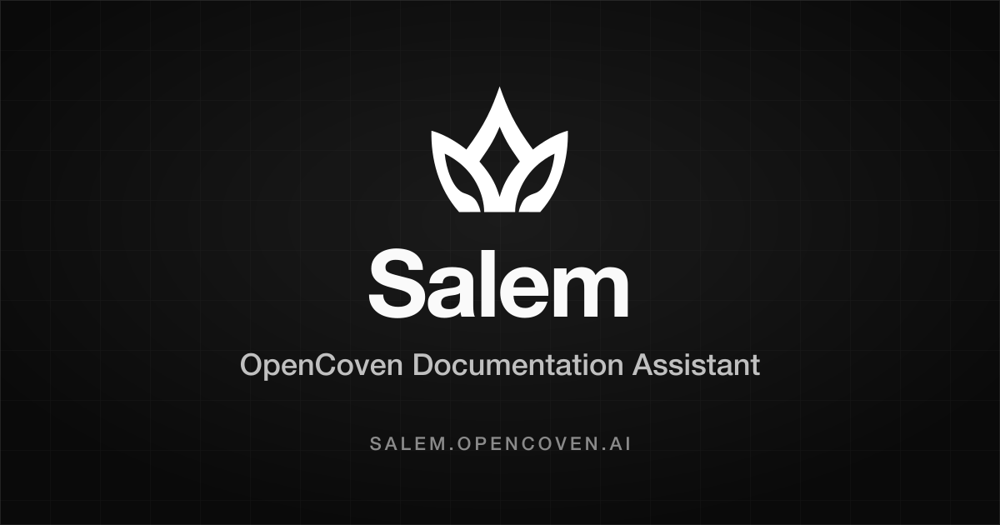

# Salem Docs Assistant API



AI-powered documentation chatbot API for [OpenCoven](https://opencoven.ai). Salem helps people navigate OpenCoven documentation through natural conversation.

## Overview

This API serves Salem, the OpenCoven docs and pathfinding assistant. It uses RAG (Retrieval-Augmented Generation) to:

1. Index OpenCoven documentation into a vector store
2. Retrieve relevant docs based on user questions
3. Stream AI-generated answers grounded in the documentation

Public documentation sources are `https://docs.opencoven.ai/llms-full.txt` and `https://docs.typesafe.ai/llms-full.txt`.
Authorized deployments can also index private OpenCoven research from server-only private sources without exposing those papers through public docs.

## Stack

- **Framework**: [Next.js](https://nextjs.org) 16 with Edge Runtime
- **Runtime**: [Bun](https://bun.sh)
- **Deployment**: [Vercel](https://vercel.com) Edge Functions
- **Vector Store**: [Upstash Vector](https://upstash.com/vector)
- **Rate Limiting / BM25 Index**: [Upstash Redis](https://upstash.com/redis)
- **AI**: OpenAI for chat completions, Gemini for embeddings, optional Cohere reranking
- **Language**: TypeScript

## Access and recent chats

Salem requires sign-in before showing the chat interface or accepting any question.
`SALEM_ADMIN_PASSWORD` signs in to the `admin` account (override its username with
`SALEM_ADMIN_USERNAME`). The former public first-question access and
`X-Salem-Admin-Password` API header are no longer supported.

Additional users must be explicitly provisioned in the server-only
`SALEM_USERS_JSON` environment variable. There is no public registration. Each user
has a unique lowercase ID and individual password; users can only view and
continue their own conversations. Do not share accounts or reuse a departed
user's ID for someone else.

To create a user entry, pipe a password of at least 12 characters from a password
manager into `bun run user:hash alice "Alice"`. The command reads stdin without
printing the password and outputs an entry containing a salted password hash. Add
`--private` to set `privateSources` on the generated entry. Collect approved
entries in a JSON array and set `SALEM_USERS_JSON` in Vercel:

```json
[{"id":"alice","name":"Alice","passwordHash":"<generated hash>","privateSources":false}]
```

Set `privateSources` to `true` only for users permitted to access private research.
No account receives it implicitly, including `admin` — see the migration note
below. Removing a user or changing their password or private-source permission
invalidates existing sessions. Deploy the environment changes to apply them.

Sessions use an HttpOnly, SameSite=Strict cookie (Secure in production), expire
after 12 hours, and are revoked on sign-out. Redis is required for sessions and
history; storage failures never allow anonymous access. Login attempts are limited
to 10 per IP per 15 minutes.

Recent chats are stored in Redis under the authenticated user, retaining the latest
20 conversations, up to 40 messages each, for 30 days after the last completed
reply. Reopen a recent chat to continue it, or choose **New chat**. Interrupted or
unsaved replies produce an error and are not added to the saved conversation.
Chats from before this feature cannot be recovered because they were not stored.

## Retrieved documentation is untrusted input

Salem indexes sources it does not author: `https://docs.typesafe.ai/llms-full.txt`,
and the markdown behind `https://code.opencoven.ai` (fetched from
`OpenCoven/coven-code`). Retrieved excerpts used to be interpolated straight into
the system prompt, which put that text at the same trust level as Salem's own
instructions — anyone who could land a paragraph in either source could issue
system-level instructions to every conversation that retrieved it.

The rule now is that **the system message is the only instruction-trusted region,
and it contains first-party text only.** Four mechanisms enforce it
(`lib/prompt-context.ts`):

1. **Separation.** Excerpts travel in a `user`-role message immediately before the
   question. No retrieved byte reaches the system message.
2. **Unforgeable delimiters.** Each excerpt sits in a
   `<salem-document nonce="…">` block whose nonce is random per request. Content
   cannot close a boundary it cannot predict, so it cannot escape its block, end
   the data region, or impersonate another role. Literal block tags and control
   characters in content are neutralised.
3. **Provenance by origin.** Each block is labelled `provenance="opencoven"` or
   `provenance="external"`, derived from the host the bytes came from — never from
   the content. A feed's `Source:` line is also bound to the host that served the
   feed (`rag/indexer.ts`), so `docs.typesafe.ai` cannot declare a page as
   `docs.opencoven.ai` and be indexed, or cited, as first-party documentation.
   Provenance governs authority over facts, never authority over instructions.
4. **Attribute-only citations.** The model is instructed to cite a block's `url`
   attribute and never a link found inside block content, so a document cannot get
   Salem to recommend a destination of its choosing.

There is deliberately no blocklist of phrases like "ignore previous instructions".
The indexed corpus is documentation about LLMs and agents, so prompt-shaped text is
legitimate content: pattern matching would mangle real docs while a paraphrase
walked past. The defences are structural instead.

This is containment, not a proof. A model can still be persuaded by text it is
told to treat as data. What the boundary guarantees is that such text arrives at
user trust level, labelled, delimited, and unable to forge structure — and that
Salem has no tools, so the worst case is a wrong answer in one session rather than
an action taken on the attacker's behalf. Adding any tool or side effect to this
route means revisiting that conclusion.

Changing the provenance rules requires a reindex to take effect for chunks already
stored: `bun run build:index`.

## API Endpoints

Salem is a **first-party, session-only API**: it serves its own UI and no other
client. There is no CORS allowlist and no preflight handler, because there is no
supported cross-origin caller. `/api/chat`, `/api/chats` and `/api/chats/[id]`
require a `salem_session` cookie and reject cross-site requests outright.

Support for the Coven Cave client (which proxied to `SALEM_CHAT_API_URL`) was
removed. Integrating an external client again would need a deliberate
server-to-server auth path — a bearer token or service credential — rather than
the browser session cookie, which is `SameSite=Strict` and cannot be forwarded
by a proxy.

| Endpoint              | Method | Description                               |
| --------------------- | ------ | ----------------------------------------- |
| `/api/session`        | POST / GET / DELETE | Sign in, inspect session, or sign out |
| `/api/chats`          | GET    | List the signed-in user's recent chats |
| `/api/chats/[id]`     | GET    | Read one of the signed-in user's chats |
| `/api/chat`           | POST   | Ask a question using an authenticated session |
| `/api/health`         | GET    | Health check                              |
| `/api/webhook`        | POST   | GitHub docs webhook for re-indexing       |
| `/api/cron/reindex`   | POST   | Protected scheduled re-index safety net   |

### POST /api/chat

First sign in through `/api/session` with `{ "username": "admin", "password": "..." }`
and retain the session cookie. Send `chatId` to continue a saved conversation;
omit it to start a new one. The API returns the ID in `X-Chat-Id` and loads prior
messages from storage. Caller-supplied user IDs and message history are ignored.

```json
{
  "message": "How do I get started with OpenCoven?"
}
```

Returns a streaming `text/plain` response with an AI-generated answer grounded in OpenCoven documentation.

**Rate Limit Headers:**

- `X-RateLimit-Limit` - Maximum requests allowed
- `X-RateLimit-Remaining` - Requests remaining in window
- `X-RateLimit-Reset` - Timestamp when the limit resets

**Debug Headers:**

- `X-Query-Id`
- `X-Best-Score`
- `X-Low-Confidence`
- `X-Result-Count`
- `X-Strategy`
- `X-Intent`
- `X-Retrieval-Ms`
- `X-Rerank-Ms`
- `X-Relevance-Rank`

No persistent query analytics or feedback endpoint is included.

## Setup

1. Install dependencies:

```sh
bun install
```

2. Copy `.env.example` to `.env` and fill in your credentials:

```sh
cp .env.example .env
```

### Environment Variables

| Variable                    | Required | Description                                      |
| --------------------------- | -------- | ------------------------------------------------ |
| `OPENAI_API_KEY`            | Yes      | OpenAI key for streaming chat completions and primary embeddings |
| `GEMINI_API_KEY`            | No       | Gemini key for embeddings when OpenAI is unavailable |
| `EMBEDDINGS_PROVIDER`       | No       | Force `openai` or `gemini`; defaults to OpenAI when available |
| `UPSTASH_VECTOR_REST_URL`   | Yes      | Upstash Vector endpoint                          |
| `UPSTASH_VECTOR_REST_TOKEN` | Yes      | Upstash Vector auth token                        |
| `UPSTASH_REDIS_REST_URL`    | Yes      | Upstash Redis endpoint for rate limits and BM25  |
| `UPSTASH_REDIS_REST_TOKEN`  | Yes      | Upstash Redis auth token                         |
| `COHERE_API_KEY`            | No       | Cohere key for reranking                         |
| `GITHUB_WEBHOOK_SECRET`     | No       | Secret for GitHub webhook                        |
| `REINDEX_SECRET`            | No       | Secret for scheduled re-index endpoint           |
| `SALEM_ADMIN_PASSWORD`      | Yes, unless named users are configured | Admin credential: a `pbkdf2-sha256:600000:...` hash, or a deprecated plaintext password. See the migration note below |
| `SALEM_ADMIN_USERNAME`      | No       | Initial admin username, defaults to `admin` |
| `SALEM_ADMIN_PRIVATE_SOURCES` | No     | Set to `true` to grant the admin account private research access. No longer implied |
| `SALEM_USERS_JSON`          | No       | Approved named users with password hashes and optional private research permission |
| `SALEM_PRIVATE_RESEARCH_DOCS_BASE64` | No | Base64-encoded private research markdown to include in Salem's index |
| `SALEM_PRIVATE_RESEARCH_REPO` | No | Private GitHub repo for research sources, for example `your-org/your-private-research` |
| `SALEM_PRIVATE_RESEARCH_REF` | No | Git ref for private research sources, defaults to `main` |
| `SALEM_PRIVATE_RESEARCH_PATHS` | No | Comma-separated private research markdown paths |
| `SALEM_PRIVATE_RESEARCH_GITHUB_TOKEN` | No | Server-only token for private GitHub research fetches |

Authentication variables are server-only. Never expose them through `PUBLIC_` or `NEXT_PUBLIC_` variables. Without a configured admin or approved user list, the interface stays locked.

### Retiring the legacy admin credential

`SALEM_ADMIN_PASSWORD` used to hold a plaintext password compared as an unsalted
single-round SHA-256, and it was the only account granted private research access
unconditionally — simultaneously the highest-privilege credential and the
weakest-hashed one. Two things changed so that neither is true any more:

- **The variable now accepts a password hash.** If its value matches
  `pbkdf2-sha256:600000:<salt>:<hash>`, the account is treated exactly like a
  `SALEM_USERS_JSON` entry and the legacy verification path is not used at all.
  A plaintext value still signs in, so no deploy locks itself out, but it is
  verified with PBKDF2-SHA256 at 600,000 iterations over a salt derived from the
  account ID, and it logs a deprecation warning on every cold start.
- **Private research access is opt-in.** `SALEM_ADMIN_PRIVATE_SOURCES=true` grants
  it; without that variable the admin account has no private-source access, whatever
  its credential form.

Session records no longer contain the plaintext admin password or a hash of it. The
session credential version is derived from the PBKDF2 output, so a Redis read is no
longer enough to recover the password offline.

**To migrate** (either route retires the legacy path; the first keeps the variable):

```sh
# In place: replace the plaintext value of SALEM_ADMIN_PASSWORD with a hash.
printf '%s' "$NEW_PASSWORD" | bun run user:hash --hash-only

# Or move the account into SALEM_USERS_JSON and unset SALEM_ADMIN_PASSWORD.
printf '%s' "$NEW_PASSWORD" | bun run user:hash --private admin "Administrator"
```

Set `SALEM_ADMIN_PRIVATE_SOURCES=true` if that account needs private research.
Changing the credential form or the private-source grant invalidates every live
session issued against the old one, which is the intent.

Private research variables are also server-only. If `SALEM_PRIVATE_RESEARCH_DOCS_BASE64` is set, Salem indexes that markdown directly. If `SALEM_PRIVATE_RESEARCH_REPO` and `SALEM_PRIVATE_RESEARCH_PATHS` are set, Salem fetches those private Markdown files through the GitHub Contents API using `SALEM_PRIVATE_RESEARCH_GITHUB_TOKEN`.

3. Build the vector index:

```sh
bun run build:index
```

## Development

```sh
bun run dev
```

Runs locally at http://localhost:3000.

## Scripts

| Script                | Description                           |
| --------------------- | ------------------------------------- |
| `bun run dev`         | Start development server (port 3000)  |
| `bun run build`       | Build for production                  |
| `bun run start`       | Start production server               |
| `bun run typecheck`   | Type-check with `tsc --noEmit`        |
| `bun run test`        | Run the full offline test suite       |
| `bun run build:index` | Index documentation into vector store |
| `bun run user:hash`   | Hash a password for `SALEM_USERS_JSON` (`--private`, `--hash-only`) |
| `bun run deploy`      | Deploy to Vercel                      |

### Pre-commit checks

This repository is public, so "no secrets in git" is enforced rather than assumed.
`bun install` installs [lefthook](https://github.com/evilmartians/lefthook) hooks via
the `prepare` script:

- **pre-commit** — `gitleaks` on the staged patch, a guard that refuses
  credential-bearing paths even when force-added past `.gitignore`, and `tsc`.
- **pre-push** — the test suite.

The same checks run in `.github/workflows/ci.yml`, because `git commit --no-verify`
skips local hooks. If gitleaks flags a false positive, add a narrow entry to
`[allowlist]` in `.gitleaks.toml` rather than disabling the hook.

## Automatic Documentation Updates

The API supports automatic re-indexing when documentation changes are pushed to the docs repository's main branch, plus a protected scheduled safety net for missed webhooks or docs deploy timing races.

1. A push is made to the main branch of the docs repository.
2. GitHub sends a webhook payload to `/api/webhook`.
3. The API verifies the signature, fetches the OpenCoven and TypeSafe documentation feeds plus configured private research sources, hashes the combined source text, and skips re-indexing when the content is unchanged.
4. When the hash changed, Salem chunks the content, generates embeddings, replaces the vector store, rebuilds BM25, and stores the new source hash in Upstash Redis.

### Scheduled Re-index

Configure QStash or another scheduler to call the protected endpoint periodically:

```sh
curl -X POST "https://salem.opencoven.ai/api/cron/reindex" \
  -H "Authorization: Bearer $REINDEX_SECRET"
```

Use `?force=1` only for manual recovery when you need to rebuild the index even if `llms-full.txt` has the same hash:

```sh
curl -X POST "https://salem.opencoven.ai/api/cron/reindex?force=1" \
  -H "Authorization: Bearer $REINDEX_SECRET"
```

The scheduler should run after docs publishing has had time to update `https://docs.opencoven.ai/llms-full.txt`. A daily schedule is usually enough; every few hours is reasonable while docs are changing quickly.

## License

MIT
